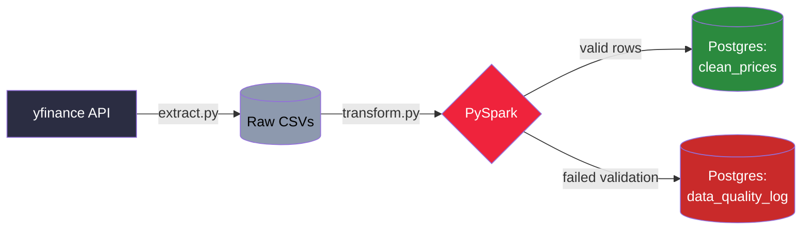

# TickerFlow

A batch ETL pipeline that fetches real market data, processes it with PySpark,
and loads it into Postgres for querying and analysis.

**Architecture:** API fetch (Python/yfinance) → raw storage → PySpark (transform) → Postgres (load)



## Setup (Docker)

Requires only Docker installed on your machine — no local Java or Python
environment needed. Java and all Python dependencies live inside the image.

1. Copy `.env.example` to `.env` and fill in your Postgres credentials:
```bash
   cp .env.example .env
```

2. Build and start the container:
```bash
   docker compose build
   docker compose up -d
```

3. Open a shell inside the running container:
```bash
   docker compose exec pipeline bash
```

4. Verify everything works (run this inside the container shell):
```bash
   python src/verify_setup.py
```
   You should see a sample Spark DataFrame print, then a Postgres version string.

**Note:** if you edit `.env` after the container is already running, the
running container won't pick up the change automatically — recreate it with
`docker compose down && docker compose up -d` first.

**Day-to-day workflow:** edit code on your host machine as normal (the
`volumes` mount in `docker-compose.yml` syncs it live), then run/test inside
the container shell. You only rebuild the image (`docker compose build`) if
you change `requirements.txt` or the `Dockerfile` itself.

## Running the pipeline

Inside the container shell:

```bash
python src/extract.py
```
Fetches OHLCV data for a set of tickers via yfinance and saves each as a
raw, untouched CSV in `raw/`.

```bash
python src/transform.py
```
Reads the raw CSVs into a PySpark DataFrame, cleans and validates the data,
and computes derived metrics (daily returns, moving averages, volatility)
using window functions.

```bash
python src/load.py
```
Writes the cleaned data to Postgres via JDBC, and any rows that failed
validation into a separate data-quality log table.

## Design notes

- **Raw/clean separation:** `extract.py` writes data exactly as fetched, with
  no cleaning. This means if a bug is found in the transform logic later,
  the pipeline can be re-run on the same raw data without re-fetching from
  the API — a standard ETL resilience pattern.
- **Why Spark:** the transform layer is built on PySpark so the design
  reflects how it would scale at real trading-data volumes (many
  instruments, tick-level granularity) where a single-machine job breaks down.
- **Why Docker:** bundles the JVM (required by Spark) and all Python
  dependencies into a single reproducible image, so the environment doesn't
  depend on what's installed on any one machine.
- **Data quality:** rows that fail validation (e.g. missing values, negative
  prices) are routed to a quarantine table instead of silently dropped,
  so failures are visible and auditable.
- **Idempotency:** loads use upsert logic keyed on (ticker, date), so
  re-running the pipeline doesn't create duplicate rows.